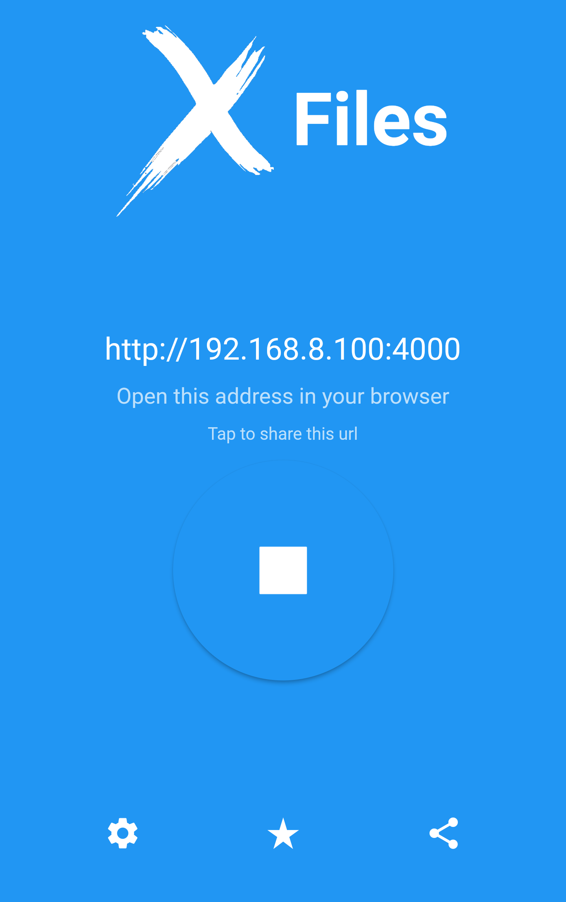
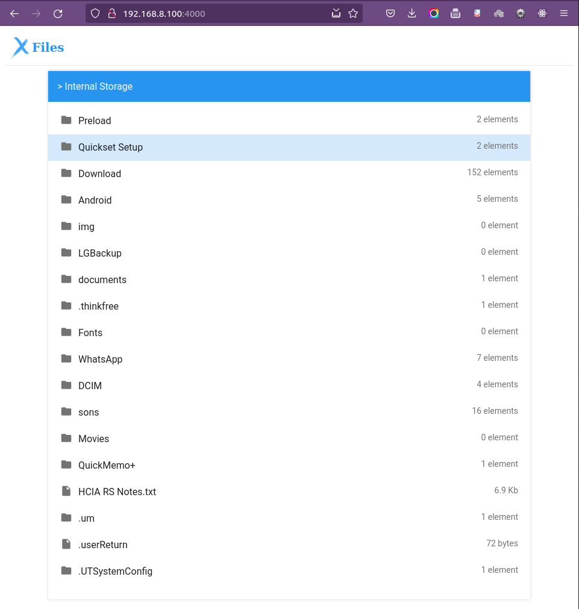

# X files
Let's Master Flutter :blush: :boom:

Share, read, update, delete files in your phone over WiFi.

## Useful Links
- [Android Manifest Permissions List](https://flutter-examples.com/add-permissions-in-androidmanifest-xml-file/)

## Mobile Screens

    
    
    

## Web Server
